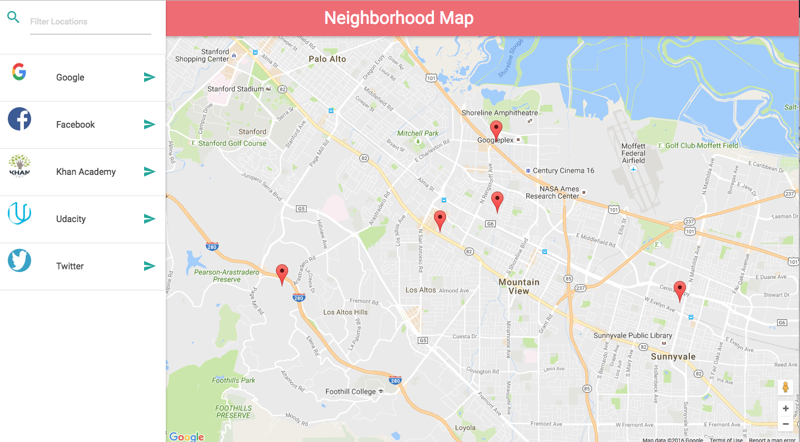

### Neighborhood Map Project using Knockout.js and third-party APIs

## Screenshot

## How to run:
1. Clone the project
2. Use a SimpleHTTPServer if you have Python installed
`python -m SimpleHTTPServer 8000`
and open up `localhost:8000` in your web browser
3. Otherwise, just start the application by opening the index.html in
    your browser

## Usage:
1. Filter locations with the search bar
2. Click on the item to display detailed information about the location
